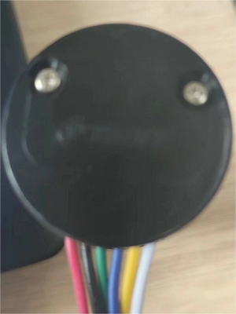

# 电机驱动模块L298N 

* `IN1,IN2,IN3,IN4`为逻辑输入口，通过单片机输出高低电平控制`OUT1,OUT2输出.` 
下图为逻辑输入对应的输出: 

 

其中，`OUT`接入电机，正反接只影响电机的正反转，当不使用PWM调速时，要用跳线帽将`ENA`,`ENB`接好，使用PWM时取下，当接上时默认PWM的占空比拉满。 
* 当使用12v电压驱动时，将电源正极接入12v，负极接入GND，同时单片机与
`L298N`共地，此时5v能够给单片机供电源，但不建议这样做，可以使用一个稳压模块将12v的电源分出降压给单片机供电 
* 使用5v电压驱动与12v驱动一样，需要将电源正负极接入5v与GND，同时单片机与驱动模块供地。如果想要使用12v以上的电压时，需要将电源口上方跳线帽拔除，但这有时会将单片姬烧掉 ~~（。。。。。）~~
 
 

# 编码电机 

* 最边缘两条线为电机的电源线，与驱动的OUT口相接，就能直接控制电机的转动 
* 中间两条线为编码电机的AB相，与单片机的读取编码的引脚相连接，在旁边的两条线为编码电机的编码器电源 

 

 
 
# OPENMV与单片机串口通信的接线 
OPENMV使用串口3与单片机通信，因此要将发送口接到单片机接收口，接收口接到单片机发送口，并且供地，如STM32F103C8T6使用串口1与OpenMV通信，
则

|单片机|OpenMV|
|-|-|
|PA9|P5|
|PA10|P4|
|GND|GND|

