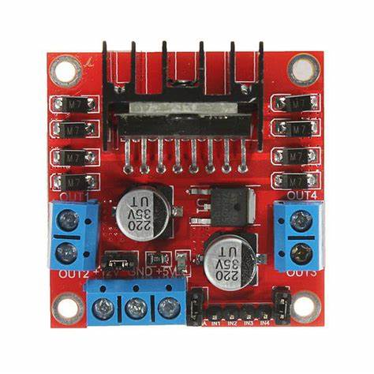
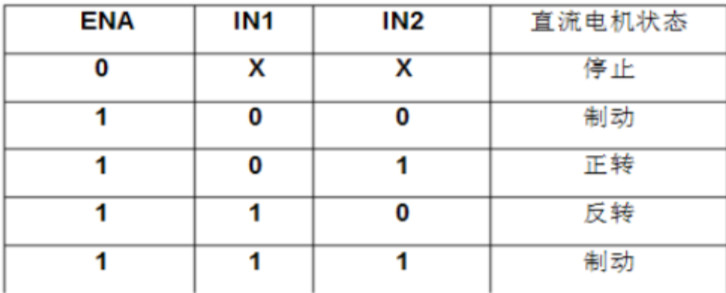

# 电机驱动模块L298N 

* `IN1,IN2,IN3,IN4`为逻辑输入口，通过单片机输出高低电平控制`OUT1,OUT2输出.` 
下图为逻辑输入对应的输出: 
 
其中，`OUT`接入电机，正反接只影响电机的正反转，当不使用PWM调速时，要用跳线帽将`ENA`,`ENB`接好，使用PWM时取下，当接上时默认PWM的占空比拉满。 
* 当使用12v电压驱动时，将电源正极接入12v，负极接入GND，同时单片机与
`L298N`共地，此时5v能够给单片机供电源，但不建议这样做，可以使用一个稳压模块将12v的电源分出降压给单片机供电 
* 使用5v电压驱动与12v驱动一样，需要将电源正负极接入5
v与GND，同时单片机与驱动模块供地。如果想要使用12v以上的电压时，需要将电源口上方跳线帽拔除，但这有时会将单片姬烧掉（。。。。。）

