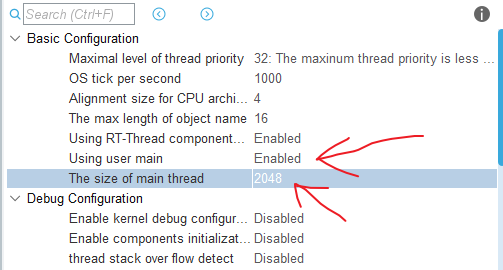
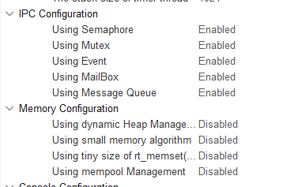
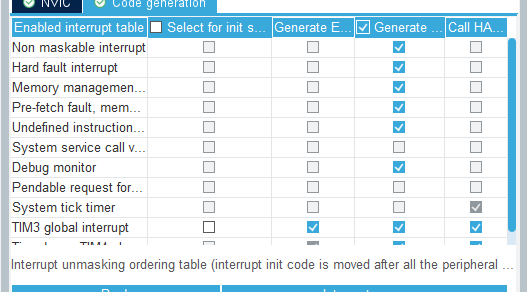
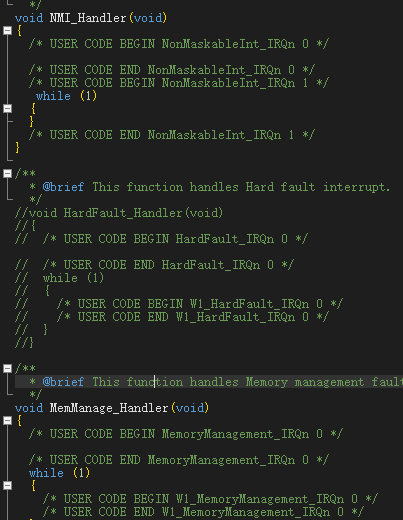
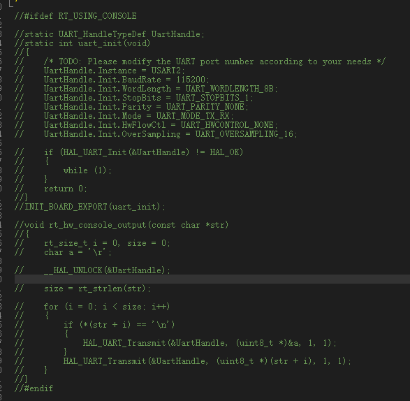
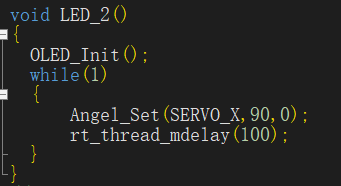

# keil移植cubemax
+ **cubemax配置rtthread时，要改对应参数**<br>
<br>
将main使能使其成为一个线程，再多给他分配栈大小<br><br>
<br>
+ 内存管理给他全关闭，否则无法静态创建线程，IPC需要开启才能使用队列，邮箱等功能<br><br>
<br>
+ 可以在中断管理器当中打开hard fault中断，在keil中找到中断管理c文件将函数注释掉<br>
<br>
以及这个地方
<br>

+ OLED初始化需要放在线程当中去，若放在main函数当中，线程全都会被阻塞掉
<br>
<br><br><br><br><br><br><br>

# 代码
+ **想要在.h文件中创建联合体，在.c文件中使用，可以将联合体实例化在结构体当中**
```c
union ReceiveData{
    short d;
    unsigned char data[2];
};

union SendData{
    short d;
    unsigned char data[2];
};

typedef struct{
    int a;
  
    union SendData left_vel_get;
    union SendData right_vel_get;
    union SendData angle_get;
    union SendData SERVO_get;
    
    union ReceiveData left_vel_now;
    union ReceiveData right_vel_now;
    union ReceiveData angle_now ;
    union ReceiveData SERVOX_now ;
    union ReceiveData SERVOY_now;
}DATA_HANDLE;

DATA_HANDLE data_handle;
data_handle.SERVOX_now.data[0]=RX_BUFFER[3];
              data_handle.SERVOX_now.data[1]=RX_BUFFER[4];
              data_handle.SERVOY_now.data[0]=RX_BUFFER[5];
              data_handle.SERVOY_now.data[1]=RX_BUFFER[6]; 

```